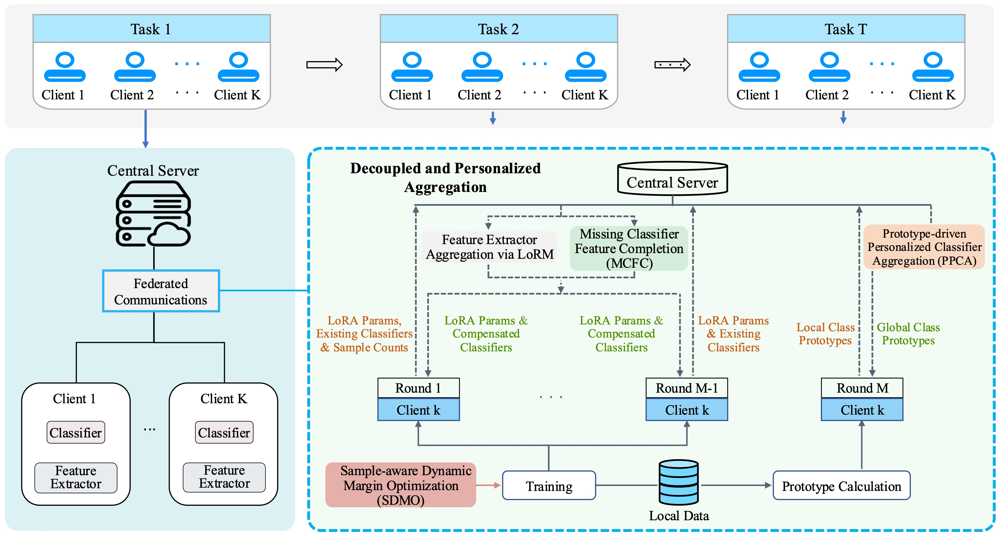

# Towards Robust Federated Class-Incremental Learning via Decoupled and Personalized Aggregation

## Introduction
>In real-world applications, global data distributions are often heterogeneous and distributed across multiple clients, while privacy constraints prohibit sharing raw data, rendering centralized class-incremental learning infeasible. Federated Class-Incremental Learning (FCIL) provides a promising solution through parameter aggregation instead of raw data sharing. However, existing FCIL methods typically adopt unified aggregation strategies that overlook the differing sensitivities of model components to heterogeneous data, resulting in substantial performance degradation. To address this issue, we propose Decoupled and Personalized Aggregation (DPA), a robust FCIL framework that enables personalized classification head learning and discriminative representation learning under heterogeneous data distributions. Specifically, Prototype-driven Personalized Classifier Aggregation (PPCA) is introduced to decouple feature extractor and classification head aggregation, enabling client-specific classification head optimization and prototype-based global classification head construction to mitigate heterogeneous interference. To further enhance the personalized aggregation process, Missing Classifier Feature Completion (MCFC) leverages global aggregation to complement missing-class representations, thereby improving local awareness of the global class space. Meanwhile, Sample-aware Dynamic Margin Optimization (SDMO) introduces adaptive margin penalties according to class sample counts, enhancing inter-class discriminability. Extensive experiments under diverse heterogeneous settings on CIFAR-100, ImageNet-R, ImageNet-A, and CUB200 demonstrate that DPA achieves state-of-the-art performance, outperforming the competitive LoRM method by an average of 8.06\% in classification accuracy.

## Environments
- Python 3.9.23
- PyTorch 2.1.0
- CUDA 12.1.0
- torchvision 0.16.0
- timm 0.9.8

## Dataset

## Usage

***The complete code will be made publicly available after the paper is accepted.***

